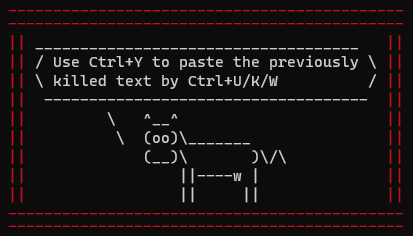

# Cowsay MOTD CWL

A CWL Workflow to generate a message of the day with helpful hints (from a cow!)

## Usage

```bash
# Set variables
QUOTES_DIR="$PWD/quotes"
BORDER_COLOUR=""
OUTPUT_FILENAME="motd.sh"
COW="default"

# Run CWL Workflow
cwltool --debug "workflow/motd_workflow.cwl" <( \
    jq --null-input --raw-output \
     --arg quotes_dir "${QUOTES_DIR-}" \
     --arg border_colour "${BORDER_COLOUR-}" \
     --arg output_file_name "${OUTPUT_FILE_NAME-}" \
     --arg cow "${COW-}" \
     '
       {
         "quotes_dir": (
           if $quotes_dir == "" then
             null
           else {
             "class": "Directory",
             "location": $quotes_dir
           }
           end
         ),
         "border_colour": (
           if $border_colour == "" then
             null
           else
             $border_colour
           end
         ),
         "output_file_name": (
           if $output_file_name == "" then
             null
           else
             $output_file_name
           end
         ),
         "cow": (
           if $cow == "" then
             null
           else
             $cow
           end
         )
       }
     '
  );

# Change permissions
chmod 755 "${OUTPUT_FILENAME}"

# Execute output
bash "${OUTPUT_FILENAME}"
```

Yields



## Adding to your MOTD

In Ubuntu 22.04, the file must be added as an executable (with no suffix) to `/etc/update-motd.d/`.  
The order of execution is determined by the prefix number, I would recommend '98' to ensure it is close to the bottom of your motd.  

An example of running and adding to your motd is shown under [scripts/update_motd_hint.sh](scripts/update_motd_hint.sh)

## Adding as a cronjob

To add as a cronjob, you can use the [scripts/update_motd_through_crontab.sh](scripts/update_motd_through_crontab.sh) script with
the following cronjob entry (note you will need to run this as the root user). Use `crontab -e` to edit your crontab.

### On reboot

```
@reboot bash /path/to/update_motd_through_crontab.sh
```

### Run hourly

```bash
0 * * * * bash /path/to/update_motd_through_crontab.sh
```

## Contributing

To add more quotes, simply add a new file to the [quotes](quotes) directory.

PRs to the workflow are also always welcome :) 
